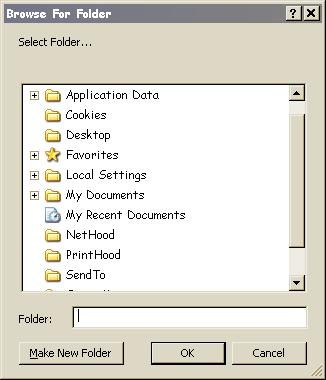

<div align="center">

## BrowseFolder Module


</div>

### Description

For those that like to create objects on the fly and avoid extra controls, this shell interface module provides easy access to the BrowseForFolder dialog with drop down list support for constants and all system folders. It even creates them with their corresponding desktop.ini file and proper icon if not present already. Windows handles the NewFolder errors and error handling is included to rule out invalid paths.
 
### More Info
 
Copy and paste code into notepad and save as Browse.bas then run. Sample code is in the Sub Main() procedure.


<span>             |<span>
---                |---
**Submitted On**   |
**By**             |[D\.W\.](https://github.com/Planet-Source-Code/PSCIndex/blob/master/ByAuthor/d-w.md)
**Level**          |Beginner
**User Rating**    |5.0 (10 globes from 2 users)
**Compatibility**  |VB 6\.0
**Category**       |[Files/ File Controls/ Input/ Output](https://github.com/Planet-Source-Code/PSCIndex/blob/master/ByCategory/files-file-controls-input-output__1-3.md)
**World**          |[Visual Basic](https://github.com/Planet-Source-Code/PSCIndex/blob/master/ByWorld/visual-basic.md)
**Archive File**   |[](https://github.com/Planet-Source-Code/d-w-browsefolder-module__1-60460/archive/master.zip)


### Source Code

```
Attribute VB_Name = "Browse"
Option Explicit
Private Const BIF_EDITBOX = &H10
Private Const BIF_NEWDIALOGSTYLE = &H40
Public Enum ShellSpecialFolderConstants
  ssfALTSTARTUP = 29
  ssfAPPDATA = 26
  ssfBITBUCKET = 10
  ssfCOMMONALTSTARTUP = 30
  ssfCOMMONAPPDATA = 35
  ssfCOMMONDESKTOPDIR = 25
  ssfCOMMONFAVORITES = 31
  ssfCOMMONPROGRAMS = 23
  ssfCOMMONSTARTMENU = 22
  ssfCOMMONSTARTUP = 24
  ssfCONTROLS = 3
  ssfCOOKIES = 33
  ssfDESKTOP = 0
  ssfDESKTOPDIRECTORY = 16
  ssfDRIVES = 17
  ssfFAVORITES = 6
  ssfFONTS = 20
  ssfHISTORY = 34
  ssfINTERNETCACHE = 32
  ssfLOCALAPPDATA = 28
  ssfMYPICTURES = 39
  ssfNETHOOD = 19
  ssfNETWORK = 18
  ssfPERSONAL = 5
  ssfPRINTERS = 4
  ssfPRINTHOOD = 27
  ssfPROFILE = 40
  ssfPROGRAMFILES = 38
  ssfPROGRAMFILESx86 = 48
  ssfPROGRAMS = 2
  ssfRECENT = 8
  ssfSENDTO = 9
  ssfSTARTMENU = 11
  ssfSTARTUP = 7
  ssfSYSTEM = 37
  ssfSYSTEMx86 = 41
  ssfTEMPLATES = 21
  ssfWINDOWS = 36
End Enum
Public Function BrowseFolder(Optional OpenAt As ShellSpecialFolderConstants) As String
Dim ShellApplication As Object
Dim Folder As Object
Set ShellApplication = CreateObject("Shell.Application")
On Error Resume Next
Set Folder = ShellApplication.BrowseForFolder(0, "Select Folder...", BIF_EDITBOX Or BIF_NEWDIALOGSTYLE, CInt(OpenAt))
BrowseFolder = Folder.Items.Item.Path
On Error GoTo 0
If Left(BrowseFolder, 2) = "::" Or InStr(1, BrowseFolder, "\") = 0 Then
BrowseFolder = vbNullString
End If
End Function
Sub Main()
Dim Msg As String
'backspace the ( HERE and retype it to see the autocomplete list
'         |
'         |
Msg = BrowseFolder(ssfPROFILE)
If Msg <> vbNullString Then MsgBox Msg
End Sub
```

